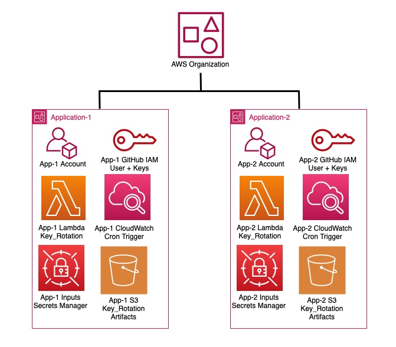

# AWS Access Key Rotation within Github Repository

## Description
Hello, I am Trevor Patch, co-founder at Nautilux Solutions. I build and consult on pipelines for automating tasks in AWS. 
Often, individuals/teams do not rotate the keys to their cloud environment, and leave their organization to higher risks of being breached.
This project is aimed at providing a free solution to rotate those AWS keys within your Github Secret Actions for any given repository.
Through the integration of this code into your Github respositories, individually, it will launch an AWS Lambda Function cron triggered by Cloudwatch every 12 hours to rotate those keys.
The scope of the project is very narrow, and makes very static assumptions. Please, contact me directly, for a custom solution built off this projects foundation, or different strategy. 

## Architecture Assumptions
- You will use a Github Repository dedicated to your application/project
- You will use a deployed an AWS Account dedicated to the application/project
- You will use a IAM Users within the application/project's AWS Account dedicated to Github Actions
- You have existing or temporary manual AWS IAM User, Role & Access Keys for the AWS Account that has permissions for Terraform to deploy:
    - IAM User
    - IAM Role
    - IAM Policy
    - Secrets Manager
    - Lambda Functions
    - S3
    - CloudWatch Events (Logs)
- Github Secrets for Actions AWS Keys are formatted as such:
    -  **AWS_ACCESS_KEY_ID**
    -  **AWS_SECRET_ACCESS_KEY**

## Deployment Steps
- Integrate this project's code into target Github repository.
- Terraform S3 Backend:
    -  Create an AWS S3 bucket, or Choose an existing bucket to maintain the Terraform State.
    -  Edit the "bucket" variable, on line 17 in file "key_roatation/providers.tf" with the S3 bucket name.
    -  Edit the "key" variable, on line 18 in file "key_roatation/providers.tf" with the desired structure with the S3 bucket.
    -  Edit the "region" variable, on line 19 in file "key_roatation/providers.tf" with the location of the S3 bucket.
- Terraform Variables:
    -  Edit the "default" for variable "respository", on line 3 in file "key_rotation/variables.tf" with the name of the Github repository the code is being deployed in.
    -  Edit the "default" for variable "environment", on line 8 in file "key_rotation/variables.tf" with the environment.
    -  Edit the "default" for variable "region", on line 13 in file "key_rotation/variables.tf" with the region this project's infrastructure is to be deployed in.
- Python/Lambda Variables:
    -  Edit the "REPOSITORY_NAME" variable, on line 5 in file "key_rotation/python/lambda_github_aws_key_rotation.py" with the name of the Github repository the code is being deployed in.
- Edit "TERRAFORM_STATE", on line 17, in file ".github/workflows/github_aws_access_key_rotation.yml". Acceptable values are:
    -  **apply** -> Provisions the components of this project.
    -  **destroy** -> Deletes/Terminates the components of this project.
- Push/Merge the code with the specified variables to the Github Repository's main branch. Github Actions will deploy a linux machine with Terraform to provision the infrastructure.
- Generate a Github Token for use by the AWS Lambda Fuction to update the specified Github Repository. It is highly recommended to generate a unique token per deployment of this project within individual Github repositories.
- Post Successful Terraform Apply via Github Actions:
    -  Log into the AWS Console for the AWS Account for the application with a role with write permissions to AWS Secrets Manager
    -  Locate the AWS Secrets Manager with the name of the Github Repository
    -  Edit the Secret's key-value pair, "GITHUB_TOKEN" with the generated Github token above.
    -  Edit the Secret's key-value pair, "GITHUB_ORG_REPOSITORY" with the Github user/organization's path and repository name. 
-  Manually trigger the Lambda Function with a name containing the name of the repository, and validate in GitHub the AWS Access Keys within the Github Secrets for Actions have been updated.
